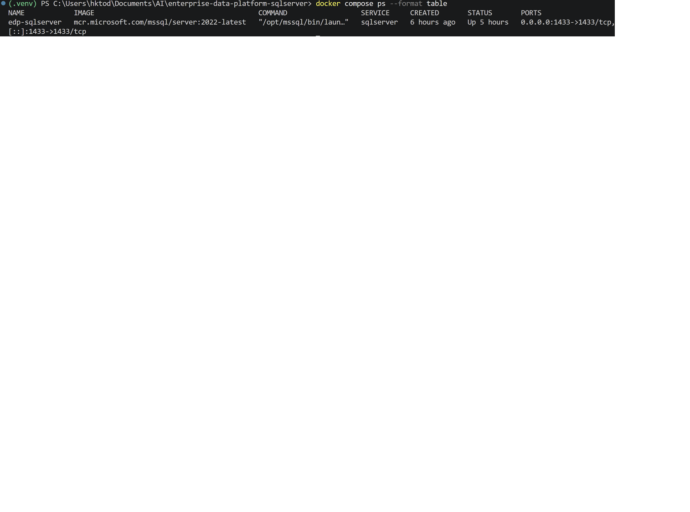
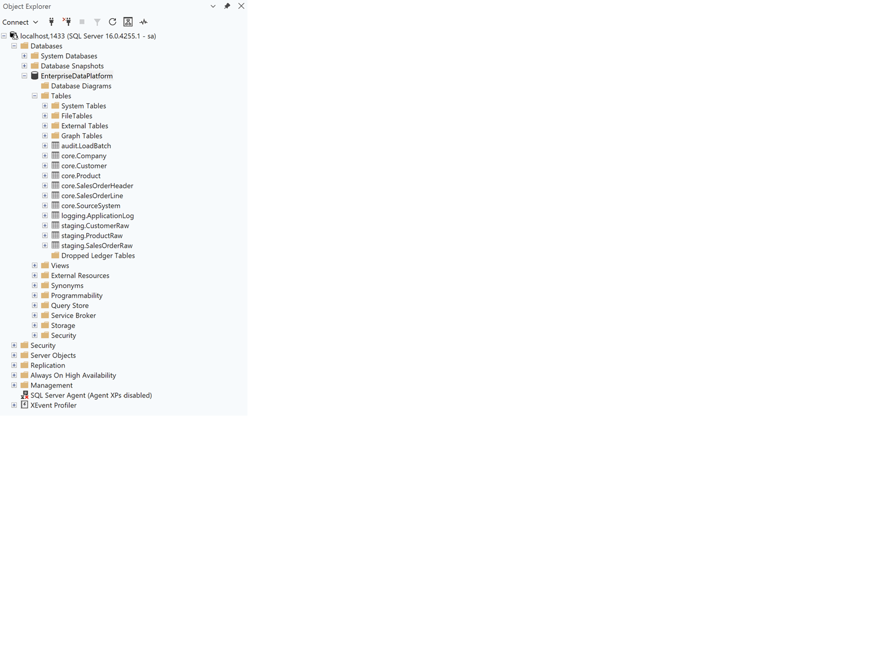
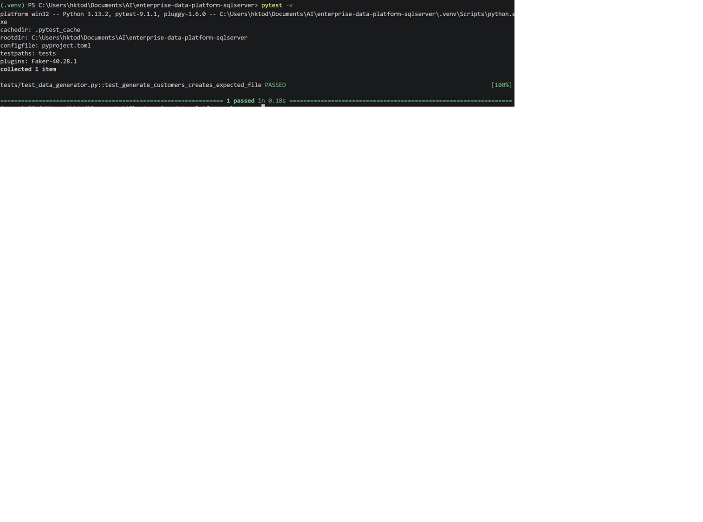

# Enterprise Data Platform – SQL Server

A production-inspired data platform built with **SQL Server**, **Python** and **Docker**.


The project demonstrates practical database engineering concepts including relational database design, ETL workflows, operational monitoring, automated testing and repeatable local deployment.

> **Status:** Active personal project developed to demonstrate practical Database Engineering and Data Engineering skills.

---

# Architecture


The architecture illustrates the overall data flow from source data through the ETL pipeline into the **staging** and **core** schemas before exposing reporting views.

---

# Features

- SQL Server 2022
- Layered database architecture
- Docker Compose local environment
- Python ETL utilities
- Staging and Core schemas
- Audit and logging tables
- Indexing examples
- Monitoring examples
- Backup and recovery scripts
- Automated Python tests
- Operational documentation

---

# Technology Stack

| Component | Technology |
|-----------|------------|
| Database | Microsoft SQL Server 2022 |
| Language | Python 3 |
| SQL | T-SQL |
| Containers | Docker Compose |
| Testing | pytest |
| Version Control | Git / GitHub |

---

# Repository Structure

```text
database/
docs/
python/
tests/
docker-compose.yml
```

---

# Getting Started

```bash
git clone https://github.com/hktodorova/enterprise-data-platform-sqlserver.git
cd enterprise-data-platform-sqlserver
docker compose up -d sqlserver
pytest
```

---

## Local Development

The platform runs locally using Docker Compose.



---

## SQL Server Deployment

The project is deployed locally using SQL Server 2022 running in Docker.

The screenshot below shows the deployed **EnterpriseDataPlatform** database in SQL Server Management Studio (SSMS), including the business schemas and tables used throughout the project.



---

# Documentation

- [Architecture](docs/architecture.md)
- [Database Design](docs/database-design.md)
- [ETL Process](docs/etl.md)
- [Monitoring](docs/monitoring.md)
- [Deployment Guide](docs/deployment.md)
- [Architecture Decisions](docs/decisions.md)

---

# Database Design


The database is organized into dedicated schemas to separate raw ingestion, business entities, auditing, reporting and operational logging.

- staging
- core
- reporting
- audit
- logging

---

# ETL


The ETL workflow follows a staging-first architecture, loading raw data into the **staging** schema before transforming validated business entities into the **core** schema.

---

# Monitoring

The project includes SQL Server operational monitoring examples such as:

- SQL Server health checks
- blocking sessions
- index fragmentation
- backup verification
- application logging
- ETL monitoring

---

# Testing

Python components are validated using automated **pytest** tests.

Current validation includes:

- local unit tests
- Docker environment verification
- SQL Server deployment testing

### Test Execution

The screenshot below shows a successful local test execution, verifying that the Python components execute correctly in the local development environment.



---

# Key Skills Demonstrated

## Database Engineering

- SQL Server database design
- T-SQL development
- Relational modelling
- Index optimization
- Backup and recovery

## Data Engineering

- Python automation
- ETL design
- Docker

## Engineering Practices

- Database monitoring
- Git version control
- Technical documentation
- Automated testing

---

# Roadmap

- Incremental ETL
- Azure SQL support
- dbt integration
- Query Store examples
- Extended Events
- CI/CD improvements

---

# License

This project is released under the MIT License.
