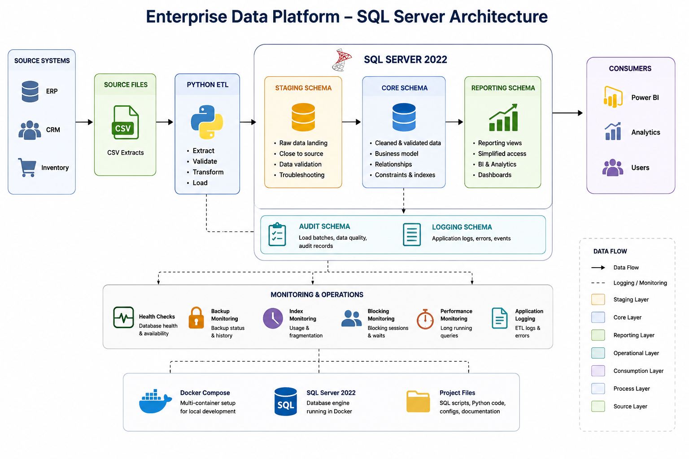

# Architecture

This project uses a small layered data platform architecture built around SQL Server and Python.

The goal is not to model a full enterprise system, but to show how data moves through a clear, layered and maintainable architecture. The diagram above illustrates the overall data flow from source systems through the ETL process into the staging and core schemas before exposing reporting views.

## Main layers

### Source extracts

Source data is represented as local files generated by the sample data generator. In a real environment, these files could come from ERP, CRM, finance, inventory or other operational systems.

### Staging

The `staging` schema is used as a landing area for incoming data. Data in this layer is close to the source format and is not expected to be fully cleaned or modeled.

This layer is useful for:

- keeping source data separate from the core model;
- validating incoming records before loading;
- troubleshooting failed or partial loads;
- supporting repeatable ETL runs.

### Core

The `core` schema contains the main relational model of the platform. This is where cleaned and validated data is stored using business-oriented tables such as companies, customers, products and sales orders.

The core layer is designed with:

- primary keys;
- foreign keys;
- basic constraints;
- indexes for common access patterns;
- audit columns for load and change tracking.

### Reporting

The reporting layer exposes simplified views over the core model. The purpose is to make data easier to consume without requiring users to understand the full relational structure.

Typical consumers could be:

- BI tools;
- reporting queries;
- analytics workflows;
- operational dashboards.

### Audit and logging

The `audit` and `logging` schemas track ETL batches, application events and operational information. This makes it easier to understand what happened during a load and to diagnose issues.

## Local runtime

The project runs locally using Docker Compose. The main runtime components are:

- SQL Server 2022 container;
- Python ETL container;
- local project files mounted into the container environment.

This makes the project easier to start and test on a new machine without installing SQL Server directly on Windows.

## Design principles

The project follows a few practical design principles:

- keep raw and modeled data separate;
- keep database objects versioned as SQL scripts;
- make local setup reproducible with Docker;
- use Python for automation and repeatable data generation;
- include tests for the Python components;
- document operational topics such as monitoring, backup and deployment.

## Current scope

The current version focuses on the foundation of the platform:

- SQL Server database structure;
- staging and core schemas;
- sample business data;
- Python data generation;
- monitoring and backup examples;
- local Docker-based development setup.

Future versions may extend the project with Azure SQL, dbt, orchestration and additional operational monitoring.
