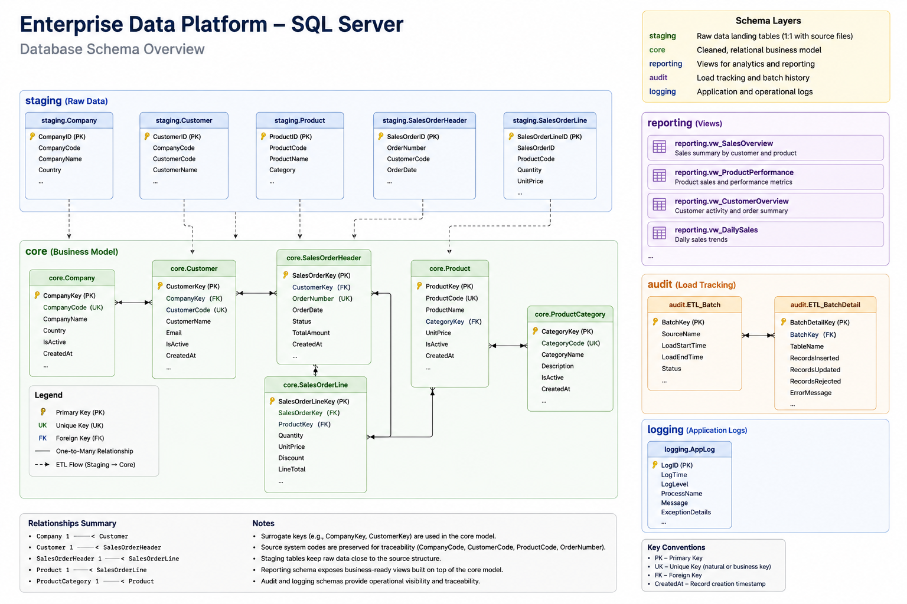

# Database Design

The database model is designed as a compact enterprise-style operational data platform. While intentionally lightweight, it follows design patterns commonly found in SQL Server environments.

The diagram above illustrates the logical relationships between the main business entities as well as the separation between the different database schemas.

---

## Schema Layout

The database is organized into dedicated schemas, each with a specific responsibility:

- **staging** – raw data loaded from external files or source extracts
- **core** – validated and normalized business entities
- **reporting** – views prepared for analytics and reporting
- **audit** – load tracking and batch history
- **logging** – application and operational messages

This separation keeps raw data isolated from curated business data, simplifies troubleshooting and supports repeatable ETL processing.

---

## Core Data Model

The **core** schema represents the primary business entities used throughout the platform, including:

- Company
- Customer
- Product
- SalesOrderHeader
- SalesOrderLine

Relationships between these entities are implemented using primary keys and foreign keys to ensure referential integrity and consistent query behaviour.

Indexes are created on frequently used lookup and join columns to support efficient query execution.

---

## Design Principles

The database model follows several practical design principles:

- keep raw source data in the staging schema
- store validated business entities in the core schema
- use surrogate keys for internal relationships
- preserve source system identifiers where appropriate
- optimize common joins using indexes
- separate operational processing from reporting workloads

---

## Why this Design?

The model is intentionally small enough to run locally using Docker while demonstrating architectural concepts that are commonly applied in enterprise SQL Server solutions.

The focus is on:

- data quality
- maintainability
- traceability
- performance
- clear separation of responsibilities