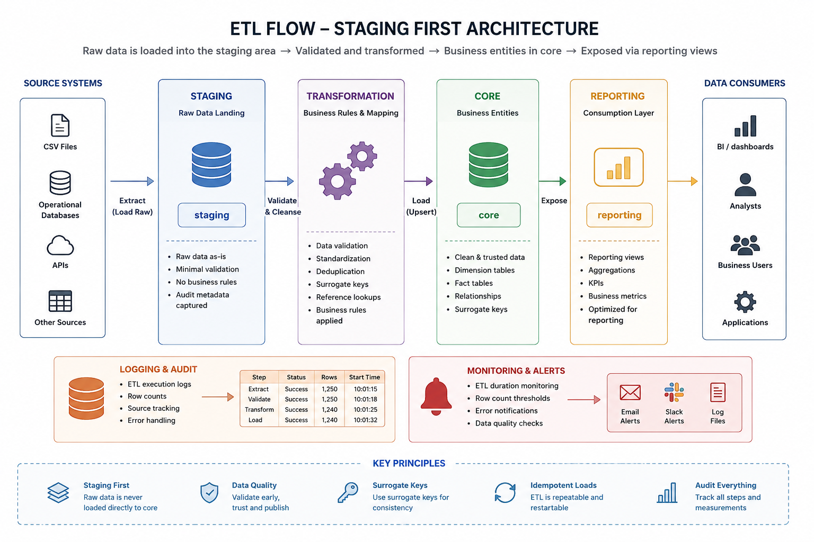

# ETL Process

The project includes a lightweight Python-based ETL pipeline that demonstrates how business data can be imported into SQL Server using a staging-first approach.

The current implementation focuses on creating a repeatable local workflow rather than a production-scale data integration platform. It provides a solid foundation that can be extended with incremental loading, orchestration and cloud services.

---

## Pipeline Flow

The ETL workflow follows a staging-first architecture illustrated in the diagram above.

Source files are generated, validated and loaded into the **staging** schema before being transformed into the normalized **core** schema. The resulting data can then be consumed by reporting and analytical workloads.

---

## Current Implementation

The current implementation includes:

- Docker-based SQL Server environment
- Python sample data generator
- CSV-based source files
- staging and core schemas
- normalized relational model
- audit and logging tables
- automated Python tests

The current implementation is intentionally lightweight, making it easy to understand, modify and execute in a local development environment.

---

## Staging-first Design

Incoming files are first loaded into the **staging** schema.

Reasons for using staging:

- preserve the original source data
- isolate invalid records
- simplify troubleshooting
- support repeatable ETL executions
- avoid loading unvalidated data into the business model

After validation, data is transformed and loaded into the **core** schema.

---

## Python Responsibilities

Python is responsible for:

- generating sample business data
- reading CSV files
- validating input structure
- transforming source records
- loading validated data into SQL Server
- logging execution details
- supporting automated tests
- supporting repeatable local development

---

## Error Handling

The project distinguishes between technical failures and data quality problems.

Typical scenarios include:

- missing required columns
- invalid data types
- duplicate business keys
- failed SQL Server connection
- unexpected ETL exceptions

Future versions will extend logging with detailed batch statistics and error reporting.

---

## Future Improvements

The ETL pipeline has been intentionally designed to allow future enhancements, including:

- incremental loading
- configuration-driven pipelines
- execution metrics and monitoring
- batch processing
- retry mechanisms
- orchestration with Apache Airflow
- dbt transformations
- Azure SQL support

---

## Summary

The current implementation demonstrates a practical staging-first ETL workflow commonly used in SQL Server data platforms.

The design focuses on repeatability, maintainability and clear separation between raw source data and validated business entities.

The architecture has been designed to be easy to understand, easy to extend and fully reproducible using Docker.
